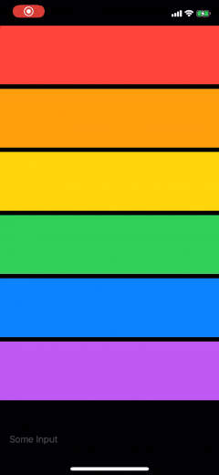

# ⌨️ Keyboard Observing
### A Combine-based solution for observing and avoiding the keyboard in SwiftUI.

 

[](https://img.shields.io/cocoapods/v/KeyboardObserving.svg)
[](https://swift.org/package-manager/)


## Table of Contents
- [About](#about)
- [Requirements](#requirements)
- [Installation](#installation)
    - [CocoaPods](#cocoapods)
    - [Swift Package Manager](#swift-package-manager)
- [Usage](#usage)
    - [KeyboardObserving](#using-the-keyboardobserving-viewmodifier)
    - [Keyboard and KeyboardObservingView](#using-keyboard-and-keyboardobservingview)


## About

This package give you the ability to observe changes to keyboard state using the `Keyboard` `ObservableObject` type.

It also provides a `KeyboardObservingView` that adjusts it's content to avoid the keyboard, and a `.keyboardObserving()` ViewModifier that adjusts the modified view to avoid the keyboard.




## Requirements

- iOS 13.0+
- Xcode 11+
- Swift 5.1+

## Installation

This package can be installed using CocoaPods or Swift Package Manager.

#### CocoaPods

Add the following line to your `Podfile`:

```
pod 'KeyboardObserving'
```

For more information about how to get started with CocoaPods, check out the [CocoaPods website](https://cocoapods.org/).

#### Swift Package Manager

Add the following to your `Package.swift` file:

```
dependencies: [
    .package(
        url: "https://github.com/nickffox/KeyboardObserving.git", 
        .branch:("master")
    )
]
```

If you're using SPM through Xcode:

1. Go to `File > Swift Packages > Add Package Dependency` 
2. Enter https://github.com/nickffox/KeyboardObserving
3. Select the `branch` option, and type "master"

For more information about how to get started with the Swift Package Manager, check out the [Official SPM website](https://swift.org/package-manager/) or the [SPM project on GitHub](https://github.com/apple/swift-package-manager).

## Usage

#### Using the `KeyboardObserving` ViewModifier

Add the `.keyboardObserving()` ViewModifier to your custom SwiftUI view. 

```swift
import KeyboardObserving

struct YourView: View {

  var body: some View {
    VStack {
      // Your Content Here
    }
    .keyboardObserving()
  }
}
```

#### Using `Keyboard` and `KeyboardObservingView`


##### 1. Add a Keyboard to your environment

In your SceneDelegate.swift file, add a `Keyboard` property, and add it to your scene's environment.

```swift
import KeyboardObserving

class SceneDelegate: UIResponder, UIWindowSceneDelegate {

  var window: UIWindow?

  // A Keyboard that will be added to the environment.
  var keyboard = Keyboard()


  func scene(_ scene: UIScene, willConnectTo session: UISceneSession, options connectionOptions: UIScene.ConnectionOptions) {
    // Use this method to optionally configure and attach the UIWindow `window` to the provided UIWindowScene `scene`.
    // If using a storyboard, the `window` property will automatically be initialized and attached to the scene.
    // This delegate does not imply the connecting scene or session are new (see `application:configurationForConnectingSceneSession` instead).

    // Use a UIHostingController as window root view controller
    if let windowScene = scene as? UIWindowScene {
      let window = UIWindow(windowScene: windowScene)
      window.rootViewController = UIHostingController(
        rootView: YourRootView()
          // Adds the keyboard to the environment
          .environmentObject(keyboard)
      )
      self.window = window
      window.makeKeyAndVisible()
    }
  }
}
```

##### 2. Create your View

Add your view's content inside of a `KeyboardObservingView` .

```swift
import KeyboardObserving

struct YourView: View {

  var body: some View {
    KeyboardObservingView {
      // Your content goes here!
    }
  }
}
```
